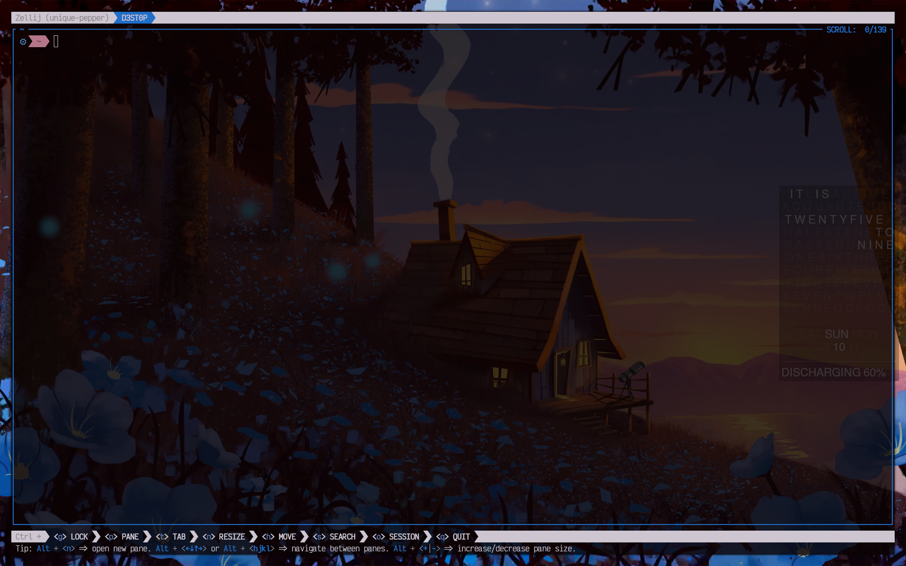

# Zellij Pywal theme generator

Generates [pywal](https://github.com/dylanaraps/pywal) theme for [Zellij](https://github.com/zellij-org/zellij)

## Usage

Just run script `./generate-theme.sh`

However, you need to run this script and restart zellij each time you change pywal colors.
So, make an alias or something like that 🧰.
